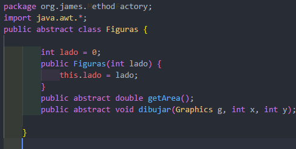
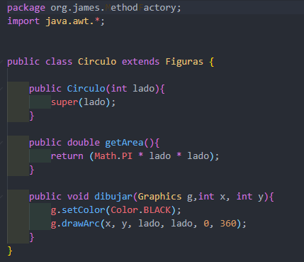
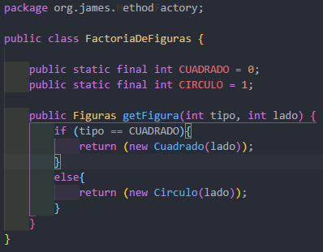
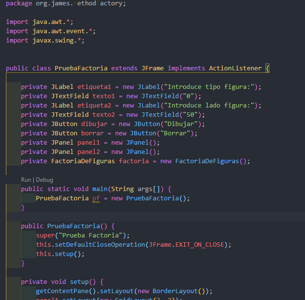
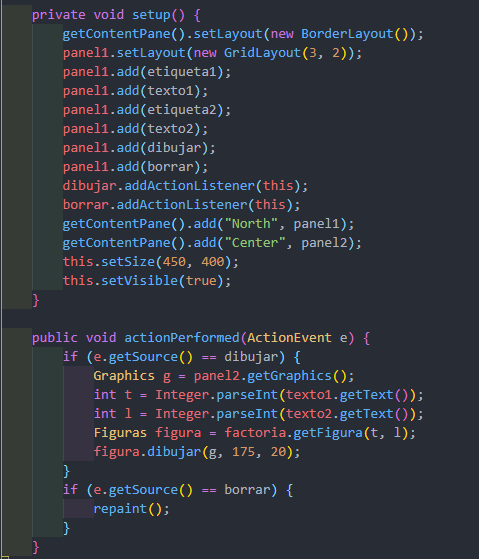

# Patrones

## Method factory

A como sabemos el method factory es un patrón de diseño creacional que proporciona una interfaz
para crear objetos en una superclase, mientras permite a las subclases alterar el tipo de objetos que se crearán.

### A continuacion un poco de explicacion del ejercicio

Lo primero sera lo que es una clase abstracta que es la clase figura, su funcionalidad en si es darnos las instrucciones u órdenes de
que hacer es decir lo que se va realizar lo que hace que sea heredado por una subclase ya que sus metodo no tiene cuerpo solo ordenes.

Ahora lo que sigue es una clase que se llama Circulo esta clase hereda desde la clase figura, lo que hace es implementar todos sus
métodos de forma obligatoria es decir definir el comportamiento como se va arealizar en este caso como vamos a calcular una area de un circulo.

Este clase Cuadrado al igual que la clase de circulo hereda desde la clase figura, implementando todos sus métodos de forma obligatoria, definimos el comportamiento como se va arealizar en este caso como vamos a calcular el area de un cuadrado.

La clase Factoria de figura en esta se declaran dos variables una cuadrado y la circulo para poder usarla en la función y poder hacer lo que es la validación al momento que se haga la ejecución del programa es decir cuando el usuario seleccione la primera opcion pueda trabajar solo con esa opcion en caso que no sea asi pues sera la otra.

Posteriormente sigue la clase PruebaFactoria, en esta clase lo que hace es crear un tipo de formulario desde cero se puede decir ya que podemos ver en las imagene la creacion de label,button,paneles y herramientas como Textfield con el proposito que el usuario pueda manipularla al momento que el programa esta en ejecución 

