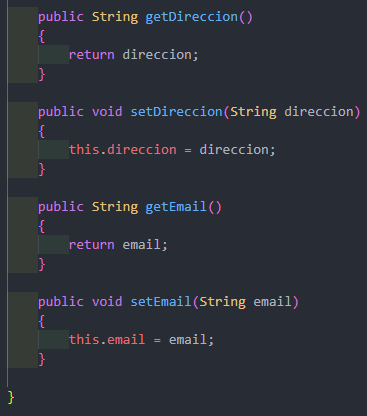
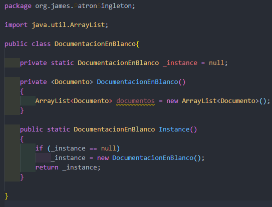
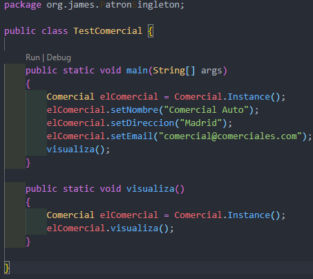

# Patron Singleton 

El patron de singleton está diseñado para restringir la creación de objetos pertenecientes
a una clase o el valor de un tipo a un único objeto. Su intención consiste en garantizar que
una clase sólo tenga una instancia y proporcionar un punto de acceso global a ella.

Ahora tratare de explicar como  funciona el ejercicio que se realizó

Lo primero es una clase que se llama comercial, esta la utilizamos para construir metodos que son lo que vamos a instanciar solo una vez, ya que el singleton solo eso nos permite que una clase pueda ser instanciada.

La clase DocumentacionEnBlanco nos permitera que el constructor sea privado para poder conseguir que sea inacccesible desde fuera de la clase para poder tener el control de la instanciacion, en palabraas sencillas bloquea que desde afuera de la clase puedan instanciarla.

Por ultimo la clase TesComercial es para instanciar la clase pasar  
lo que necesita en este caso nombre. correo y direccion, luego podemos ver el resultado de ella 

